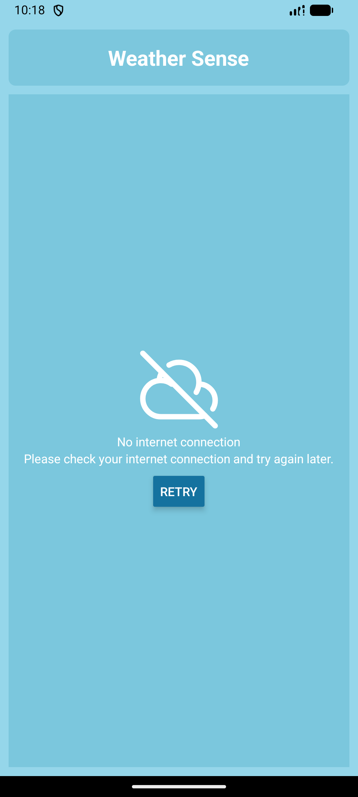
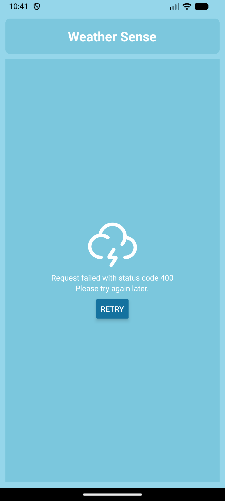

# WeatherSense

A beautiful and intuitive React Native weather application that provides detailed 5-day weather forecasts with comprehensive meteorological data.

## 🌟 Features

- **5-Day Weather Forecast**: Get accurate weather predictions for the next 5 days
- **Detailed Weather Information**: View temperature, weather conditions, humidity, precipitation, wind speed, pressure, visibility, and UV index
- **Offline Support**: App works offline with cached data when internet is unavailable
- **Beautiful UI**: Clean, modern interface with intuitive weather icons
- **Real-time Data**: Fetches live weather data from Open-Meteo API
- **Cross-Platform**: Currently supports Android devices (iOS support planned)

## 📱 Screenshots & Demo

### App Demo Video

🎥 [Watch Full Demo Video](demo/app_demo.mov)

_Click the link above to view the complete app demonstration_

### Screenshots

| No Network State                   | API Failure                          |
| ---------------------------------- | ------------------------------------ |
|  |  |

_More screenshots coming soon!_

## 🛠️ Tech Stack

- **React Native 0.77.0** - Cross-platform mobile development
- **TypeScript** - Type-safe JavaScript
- **Redux & Redux Saga** - State management and side effects
- **Axios** - HTTP client for API requests
- **Open-Meteo API** - Free weather data API
- **HugeIcons** - Beautiful weather icons
- **React Native NetInfo** - Network connectivity detection

## 🚀 Getting Started

### Prerequisites

- Node.js >= 18
- npm
- React Native development environment
  - For Android: Android Studio with Android SDK
  - For iOS: Xcode (macOS only) - _iOS support not yet tested_

### Installation

1. Clone the repository:

```sh
git clone https://github.com/PaviMohan/WeatherSense.git
cd WeatherSense
```

2. Install dependencies:

```sh
npm install
```

### Running the App

#### Start Metro Bundler

First, start the Metro development server:

```sh
npm start
```

#### Android

With Metro running, open a new terminal and run:

```sh
npm run android
```

#### iOS

_iOS support is planned but not yet tested. The app may work on iOS but has not been verified._

## 📁 Project Structure

```
WeatherSense/
├── android/                 # Android native code
├── ios/                     # iOS native code
├── src/
│   ├── components/          # Reusable UI components
│   │   ├── error-view/      # Error display component
│   │   ├── header/          # App header
│   │   ├── text/            # Custom text component
│   │   └── widget/          # Weather data widgets
│   ├── redux/               # State management
│   │   ├── store.ts         # Redux store configuration
│   │   └── weather/         # Weather-related state
│   ├── screens/             # App screens
│   │   └── weather/         # Weather screen
│   └── utils/              # Utilities and constants
│       ├── constants.ts     # App constants and types
│       └── helper.ts        # Helper functions
└── package.json             # Dependencies and scripts
```

## 🔧 Available Scripts

- `npm start` - Start Metro bundler
- `npm run android` - Run on Android device/emulator
- `npm run ios` - Run on iOS simulator/device _(not yet tested)_
- `npm test` - Run Jest tests (Yet to start)
- `npm run lint` - Run ESLint

## 🌤️ Weather Data

The app fetches weather data for Chennai, India (latitude: 13.0414, longitude: 80.1267) from the Open-Meteo API, which provides:

- Daily temperature (mean)
- Weather codes with descriptions and icons
- Apparent temperature
- UV index
- Precipitation probability
- Relative humidity
- Surface pressure
- Wind speed
- Visibility

## 🤝 Contributing

1. Fork the repository
2. Create a feature branch (`git checkout -b feature/amazing-feature`)
3. Commit your changes (`git commit -m 'Add some amazing feature'`)
4. Push to the branch (`git push origin feature/amazing-feature`)
5. Open a Pull Request

## 🙏 Acknowledgments

- [Open-Meteo](https://open-meteo.com/) for providing free weather API
- [HugeIcons](https://hugeicons.com/) for beautiful icons
- React Native community for the amazing framework
